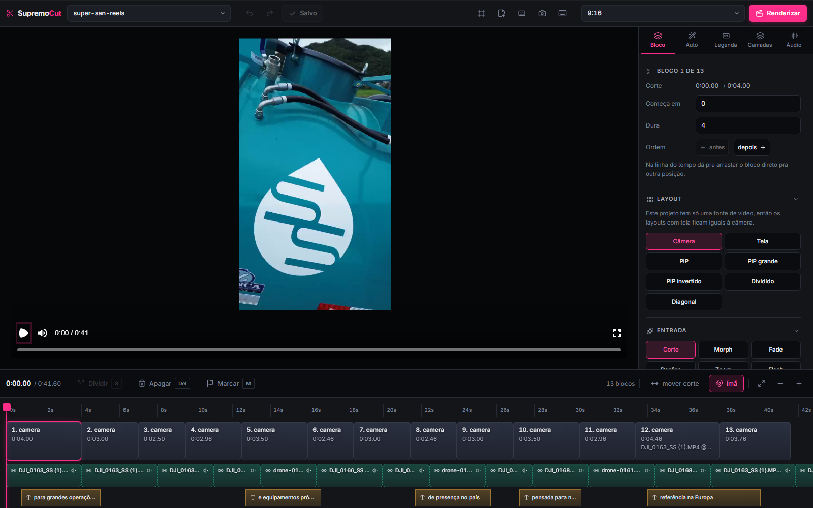

# SupremoCut

Fábrica de anúncios verticais 9:16. Um motor em Python que corta, sincroniza,
transcreve, narra e masteriza — e um estúdio em Remotion com editor visual, onde
o vídeo é editado por **camadas** e renderizado pelo mesmo código que o preview
mostra.

Nasceu de um problema concreto: entregar dezenas de anúncios em português, todos
no mesmo padrão visual, sem abrir um editor de vídeo tradicional para cada um.



---

## O que ele faz

**Do material bruto ao MP4 pronto**, sem passar por editor externo:

- **Corte** — sincroniza câmera e tela, encontra silêncios, remove o que sobra e
  escreve um roteiro editável.
- **Transcrição e legenda** — Whisper local, legenda palavra a palavra, com
  presets (Hormozi, karaokê, neon, caixa) e realce por palavra-chave.
- **Narração** — texto vira voz (ElevenLabs) ou aceita um MP3 gravado por você,
  encaixando o áudio na duração do corte sem estourar o vídeo.
- **Áudio profissional** — normalização em duas passagens a −14 LUFS, música com
  abaixamento automático sob a voz.
- **Edição por camadas** — texto, forma, imagem e vídeo flutuante, cada um com
  posição, tempo e ordem de empilhamento próprios.
- **Render** — três formatos (16:9, 9:16, 1:1) do mesmo projeto.

---

## Como roda

Precisa de **Python 3.11+**, **Node 20+** e **FFmpeg** no PATH.

```bash
# uma vez
python -m venv .venv
.venv\Scripts\pip install -r requisitos.txt
cd estudio && npm install && cd ..

# confere se o ambiente está de pé (FFmpeg, GPU, modelos)
python motor/supremo.py checar

# cria um projeto e prepara o material de entrada/
python motor/supremo.py novo meu-anuncio
python motor/supremo.py preparar meu-anuncio

# abre o editor visual (sobe o servidor de dados e a interface)
python motor/supremo.py editor meu-anuncio

# renderiza
python motor/supremo.py render meu-anuncio --formato Vertical
```

Chaves de API (ElevenLabs, etc.) vão num `.env` na raiz — que está no
`.gitignore` e nunca é versionado.

---

## Arquitetura

Duas metades que se falam por **JSON**, e só por JSON.

```
material bruto ──▶  motor/ (Python)  ──▶  roteiro.json  ──▶  estudio/ (Remotion)  ──▶  MP4
                    corte, áudio,          o projeto          composição React
                    transcrição,           inteiro num
                    narração               arquivo
```

### `motor/` — Python

O que exige processar mídia de verdade: FFmpeg, Whisper, síntese de voz,
masterização. Escreve `projetos/<nome>/roteiro.json` e para por aí.

| módulo | o que resolve |
|---|---|
| `supremo.py` | a linha de comando: `novo`, `preparar`, `editor`, `render` |
| `sincronizar.py` | alinha câmera e tela pelo áudio |
| `transcrever.py` | Whisper local, com tempo por palavra |
| `roteirizar.py` | decide os cortes e escreve o roteiro |
| `voz.py` / `narracao.py` | síntese, e encaixe da narração na duração do corte |
| `masterizar.py` | loudness em duas passagens, −14 LUFS |
| `conferir_entrega.py` | confere o MP4 entregue contra a narração que o gerou |

### `estudio/` — Remotion + React

O que é desenho: composição, camadas, animação, render. O editor é uma interface
Vite que conversa com um servidor Express pequeno (`servidor.mjs`) — ele lê e
grava os JSON e dispara o render.

| arquivo | o que é |
|---|---|
| `src/Video.tsx` | a composição: cenas, áudio, legenda e a pilha de camadas |
| `src/camadas.ts` | o modelo de camadas (texto, forma, imagem, vídeo) |
| `src/trechos.ts` | cor por pedaço de texto, e o que acontece quando o texto muda |
| `src/fonte.ts` | validação da cadeia de fontes antes de entregar ao CSS |
| `src/migrar.ts` | traduz projetos no modelo antigo, na leitura, sem tocar no disco |
| `editor/` | a interface: timeline, painéis, seleção múltipla |
| `captura.mjs` | captura de quadro reaproveitando o pacote — 1 a 2 s em vez de 40 |

---

## O modelo de camadas

Um "lower third" já foi um tipo composto: um objeto que desenhava barra, título e
subtítulo de uma vez. Prático de criar, impossível de editar — não havia onde
clicar para mover só a barra, ou dar outra cor à segunda linha.

Hoje cada coisa na tela é uma **camada independente** de um dos quatro tipos
primitivos. Um lower third deixou de ser um tipo e virou um **arranjo**: três
camadas que um atalho cria de uma vez e que depois vivem separadas.

A ordem da lista é o empilhamento — o último desenha por cima, como o `z-index`
do CSS e como a timeline de qualquer editor.

```ts
type CamadaTexto = {
  tipo: "texto";
  texto: string;
  x: number; y: number;        // fração do quadro
  tamanho: number; peso: number;
  fonte?: string;              // vazio herda a do projeto
  trechos?: TrechoTexto[];     // cor por faixa de índice
  entrada?: EntradaCamada;
  saida?: SaidaCamada;
};
```

Campos opcionais são opcionais de propósito: nenhum projeto existente precisa ser
convertido para ganhar recurso novo.

---

## Decisões que valem explicar

**Preview e render usam o mesmo código.** É a razão de existir do Remotion aqui.
Quando os dois divergem — e divergiram — é bug, não expectativa. O caso mais caro
foi o motor lendo o estilo *global* enquanto o editor lia o do projeto: o editor
mostrava uma fonte e o MP4 entregue saía com outra, sem erro nenhum.

**Verificar é medir, não olhar.** Um render que termina dizendo "pronto" não
prova nada. O projeto usa SSIM entre quadros para provar que uma refatoração não
mudou um pixel; correlação de envelope de áudio para provar que o MP4 entregue
carrega a narração certa; e um script (`provar_conferencia.py`) que existe só
para demonstrar que o conferidor **sabe reprovar** — um conferidor que aprova
tudo é um carimbo.

**A `entrada` e a `saída` de uma camada são tipos separados.** Parece
redundância até a tarja que cobre legenda queimada esmaecer no fim: uma cobertura
que some não cobre, e o texto por baixo reaparece no meio do anúncio.

**Tempo é quantizado em quadro inteiro.** `Math.round(v * fps) / fps` em toda
fronteira. Sem isso, o erro de ±1 quadro na emenda de áudio aparece como um
clique audível.

---

## Testes

```bash
cd estudio && node --test "testes/*.test.mjs"
```

Cobrem a álgebra que erra em silêncio: as faixas de cor no texto (pintar por
cima, editar o texto embaixo de uma faixa já posta) e a validação da cadeia de
fontes. Os testes carregam os módulos `.ts` de verdade, transpilados na hora —
não uma cópia da regra colada no arquivo de teste, que passaria a mentir no dia
em que as duas divergissem.

---

## O que não está aqui

- **`material/`, `saida/`, `trabalho/`** — insumo e artefato. Um repositório que
  carrega o bruto de cada job vira intransportável na terceira campanha.
- **`projetos/`** — os roteiros e a copy dos anúncios são conteúdo de cliente, e
  ficam fora do versionamento.
- **`.env`** — chaves de API. Nunca versionado.

---

## Estado

Em uso. Doze anúncios em português entregues e conferidos um a um, e um Reels
vertical montado do zero a partir de material de drone.

Sabidamente incompleto em dois pontos, ambos documentados no código:

- A posição do subtítulo num lower third é um número fixo, calculado para título
  de **uma** linha. Título que quebra em duas precisa de um empurrão manual — o
  navegador sabe medir a altura real, e é para lá que isso deve ir.
- Detecção de batida para cortar no ritmo da música ainda não existe; os cortes
  do Reels foram escolhidos à mão.
